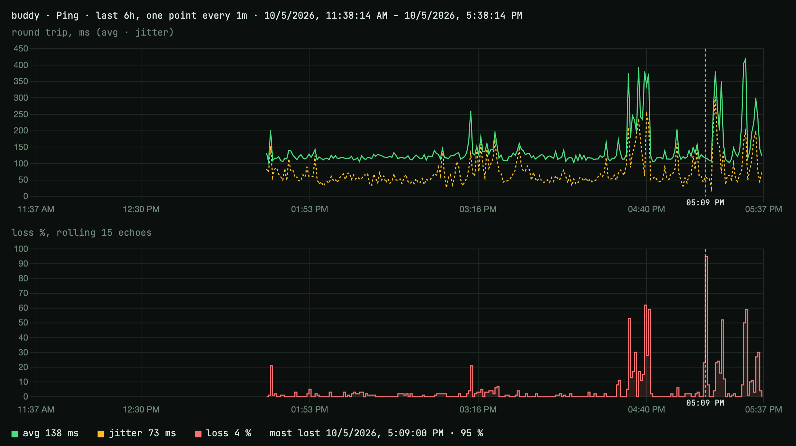

# my-buddy



MicroPython device that keeps time, pings 8.8.8.8, and shows the results on an st7789 display. Ping batches reach the Recorder over MQTT, where `receiver/history.sh` records them and serves `receiver/history.html`: round trip, jitter and loss over the last 15 min to 1 week, a crosshair across both charts, and a PNG export like the one above.

Layout: the repo root and `lib/` go on the Terminal; `receiver/` is the Recorder (runs on a VPS as a Docker image, `ghcr.io/minlaxz/buddy-receiver`); `tests/` are host self-checks plus `sender.sh`, a Sender for pushing a Message or LED by hand.

See `CONTEXT.md` and `docs/adr/` for the design.

## Recorder on a VPS

GitHub Actions builds `ghcr.io/minlaxz/buddy-receiver` (amd64 + arm64) on every push to `main` touching `receiver/`.

`docker-compose.yaml` runs the Recorder beside `cloudflared`. On the VPS, next to it, put a `.env`:

```sh
CLOUDFLARED_TUNNEL_TOKEN=...
MQTT_HOST=...
MQTT_USER=sender
MQTT_PASS=...
```

then `docker compose up -d`. In the tunnel, point the public hostname at `http://my-buddy-receiver:8000`. History lands in `./data/ping.db` (SQLite).

Bring in an old JSONL (the Mac's, or the VPS's own from before SQLite). Rows already stored are skipped, so it is safe to run twice, and safe while the Recorder runs:

```sh
docker compose exec my-buddy-receiver python3 /app/receiver/ingest.py /data/ping.db /data/ping.jsonl
mv data/ping.jsonl data/ping.jsonl.bak   # delete once the graph looks right
```

The page loads only the Range it shows: from a date and hour to another (or to now), today from midnight by default. It is read-only (no clear buttons); rows older than six months are dropped automatically.
